# Flint: the Ambient Smart Desk Display Powered by FlintOS

**By Ameya Angadi**

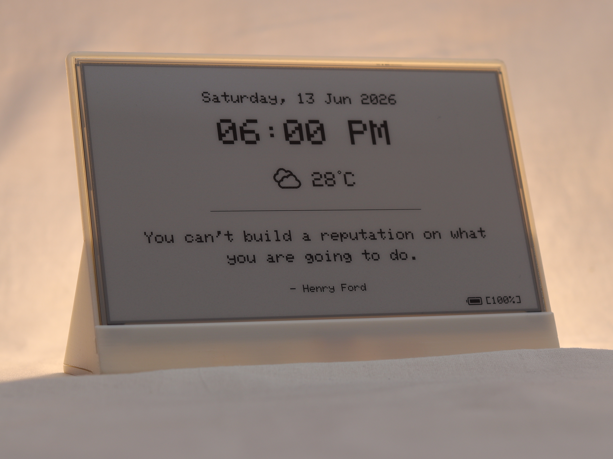

Flint is a sleek, low-power ePaper smart desk display powered by FlintOS, featuring a dual-mode system that fluidly toggles between high-contrast productivity dashboards and an ambient digital photo frame. Designed around the principles of "productivity focused technology," it integrates live API pipelines, including weather, crypto, stocks, and tasks to do, to serve as a glanceable, distraction-free information hub for your workspace.

## Problem Statement
Modern workspaces are in the midst of a crisis defined by "Screen Fatigue" and notification overload. Our daily environments are saturated with glowing rectangles constantly competing for our limited attention. While smartphones and secondary LCD monitors offer immediate access to information, they fundamentally act as friction-heavy distraction engines. Their emissive backlights strain our eyes, and their operating systems are designed to pull us down rabbit holes of un-actionable alerts.

This creates a modern paradox: we want glanceable, persistent access to daily metrics, like the local weather, our daily schedule, or a cryptocurrency portfolio, but we want it without inviting digital clutter or glowing backlight distractions into our physical workspace. We need information that waits for us, rather than information that demands our immediate attention.

## Our Solution: Introducing Flint
**Flint** is a sleek, low-power, ambient desktop hardware platform designed to reclaim your focus. By utilizing ePaper technology, Flint strips away the backlight, the notifications, and the endless scrolling, leaving only what matters.

Running at the heart of this hardware is **FlintOS**, an evolving, dual-mode software ecosystem built entirely around curated, high-contrast, distraction-free widget templates. FlintOS treats your personal data as static, glanceable art. It transforms real-time attention traps into a calming, functional display that seamlessly blends into your environment.

**FlintOS is a quiet reminder that technology should serve your mind, not steal it.**


## Functional Demonstration (Video Showcase)
To get a better sense of the ePaper display and how FlintOS actually feels to use, I've put together three videos.

*   **Part 1 - The Trailer:** Start here to see the device in action. This is a short look at how FlintOS fits into a real workspace, highlighting the 3D-printed chassis, the paper-like texture of the 7.5" screen, and the core dashboards. *(Note: Best viewed in 4K for the full cinematic effect. Click the image attached below to view the video)*
[](https://youtu.be/I_J9A8PyoRs)

*   **Part 2 - Project Overview:** If you want a quick look under the hood, this video provides a overview of how FlintOS was put together. It briefly walks through the implemented features, explaining the core software setup and how the Seeed Studio hardware is integrated. *(Click the image attached below to view the video)*
[](https://youtu.be/HHZJ5c6u9Fs)

*   **Part 3 - Step-by-Step Build Guide:** A rapid, under-3-minute assembly video showing exactly how to put the hardware together. It covers everything from preparing the 3D-printed enclosure to mounting the Seeed Studio DIY kit components and securing the 7.5" ePaper panel. *(Click the image attached below to view the video)*
[](https://youtu.be/kQH2qlkbCiA)

## Implemented Features
*   **Minimalist Home Screen:** It displays a **large digital clock** updating via partial refresh every minute, along with the **current date, weather with custom icons, a daily inspirational Quote, and a precise battery percentage.**


*   **Clean Weather Hub:** A split-screen meteorological display showing **local temperature, "feels like" temp, humidity, wind speed, atmospheric pressure, and precise sunrise/sunset times.**


*   **Crypto Market Monitor:** Designed for the passive investor, this high-contrast dashboard tracks real-time prices and 24-hour percentage changes for four major cryptocurrencies **(BTC, ETH, SOL, DOGE)**. By relying on live API pipelines, the ESP32 fetches and parses the latest JSON payloads, mapping the data into clean, pill-shaped UI containers. The minimalist layout ensures portfolio metrics remain highly readable from across the room without inducing the anxiety of a constantly flashing, red-and-green trading screen.


*   **Traditional Stock Market Tracker:** This screen utilizes a custom Google Apps Script pipeline to track five specific equities on the **Indian stock market**. The firmware executes complex layout math to evenly space the rows and employs automatic text-truncation to neatly clip long company names (e.g., "Tata Motors Passen.."). Furthermore, it leverages the custom `icons.h` asset library to render a crisp Indian Rupee (₹) symbol, resulting in a beautifully formatted, localized financial dashboard that updates silently in the background.


*   **Daily Tasks & Dynamic Calendar:** This dual-purpose productivity hub keeps your day meticulously organized without the distraction of smartphone notifications. The left pane connects directly to the **Todoist API**, pulling your active daily tasks into a crisp, easily digestible checklist. You can **install Todoist app on your phone or use their website for PC to add, modify, remove and manage your tasks**. The device will display your uncompleted tasks so that you don't have to check them on your phone. On the right, FlintOS automatically renders a precise monthly calendar grid. The system dynamically calculates day offsets for the current month and intelligently highlights the present day with an inverted, high-contrast bounding box so you can immediately ground yourself in your schedule.


*   **Focus Stopwatch:** Features a Focus Stopwatch, a start/stop productivity timer tracking active sessions and saving your total daily work minutes directly to the ESP32's permanent flash memory which is reset at midnight every day. **Unlike a Pomodoro timer it does not restrict your flow state**, so that you can measure your work without being interrupted every 25 minutes, allowing you to work as much or as little as you want depending on your mind's state wihout feeling guilty.


*   **Wellness Reminder:** To foster a sustainable and positive work environment, FlintOS includes an automated Wellness Check that serves as a gentle mental reset. Rather than relying on jarring audio alarms or aggressive smartphone notifications, this interstitial screen quietly overlays your current dashboard every 30 minutes. It **presents four mindful prompts: focusing on hydration, gratitude, physical movement, and creating a positive headspace, calmly encouraging you to step back from deep work and take care of yourself**. Once you have taken a moment to recharge, pressing any of the three physical hardware buttons instantly dismisses the reminder and returns you seamlessly to your active workflow. If you don't press any button the screen automatically fades away after 5 minutes into the normal mode.


*   **Ambient Slideshow & Digital Photo Frame:** When it is time to step away from deep work, FlintOS seamlessly transitions into a **high-contrast digital photo frame**. By pressing the **PREV and NEXT buttons simultaneously**, the system toggles out of Productivity Mode and begins cycling through a curated **slideshow of five personal images**, automatically advancing every five minutes. To maintain accurate timekeeping without disrupting the artwork, a floating **clock widget in the bottom right corner** executes a localized partial screen refresh every minute. This ensures the device remains a reliable timepiece without triggering the jarring, full-screen black-and-white flash typical of ePaper displays. You can add more images by changing the memory partioning scheme in tools.
> The slideshow capacity can be expanded by adjusting the microcontroller's memory partitioning scheme within your IDE settings to allocate more flash space for assets.


## Design Ideology & Naming Philosophy
**Why "Flint"?:** The name Flint originates from the ancient stone used to strike a spark. In a world of hyper-complex consumer electronics, Flint represents a return to fundamental, minimalist utility. It evokes a raw texture, a grounding presence, and lasting reliability. It is the quiet spark that brings intelligent organization to your desk without burning through your attention.

**Design Thinking Process:** Every element of Flint was heavily scrutinized through the lens of productivity focussed technology.
*   **The Medium:** ePaper display was chosen because it displays graphics with a soft and ambient light rather than emissive backlights. It looks exactly like ink on paper, resting the eyes from the digital fatigue.
*   **The Minimalist UI:** We rely on sharp layout grids, precise dithering for photos, and intentional whitespace. The whole UI was designed by keeping things simple and minimalistic.
*   **The Psychology:** A "**non-distracting UI**" means filtering information down to only essential things. By removing touchscreens and color, the user checks Flint entirely at their own pace. Advanced UI implementations, like Wellness Reminders: a self-care popup overlay that triggers every 30 minutes to remind you to hydrate and stretch, function as gentle nudges rather than demanding alarms.

## Hardware Component List (BOM)

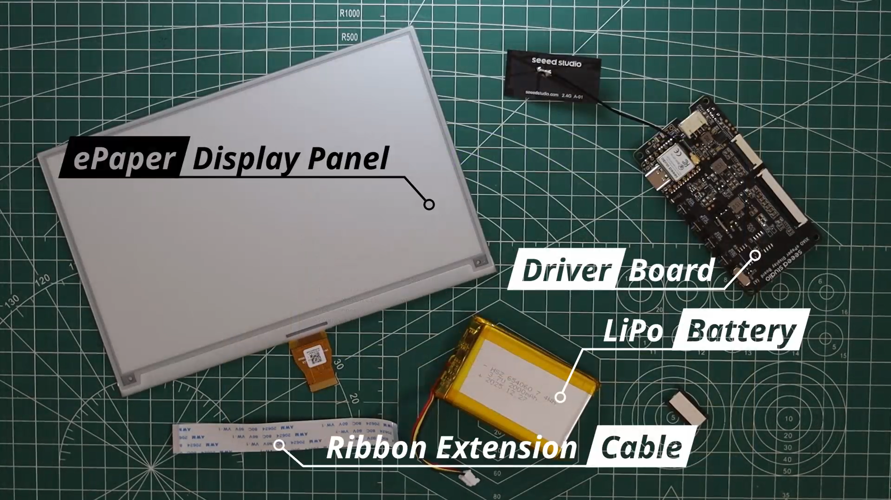

| Component Name | Core Function | Specifications/Model | Quantity |
| :--- | :--- | :--- | :--- |
| **ePaper Display Panel** | Primary visual interface | 7.5-inch High-Contrast e-Ink (Black/White) | 1 |
| **Custom Driver Board** | Microcontroller & Display Driver | Seeed Studio Xiao ESP32 S3 PLUS | 1 |
| **LiPo Battery** | Power supply | 3.7V, 2000mAh (with JST connector) | 1 |
| **Ribbon Extension Cable** | Connects display to driver board | 24-pin FPC Flat Flexible Cable | 1 |
| **Flint Chassis** | Hardware enclosure | 3D Printed PLA Frame | 1 |

<br>

Building Flint requires a list of components designed for maximum efficiency and a minimal footprint. The build needs the following components:
1.  TRMNL 7.5" (OG) DIY Kit by Seeed Studio - [Link](https://www.seeedstudio.com/TRMNL-7-5-Inch-OG-DIY-Kit-p-6481.html?sensecap_affiliate=JI84v1k&referring_service=link)
2.  USB Type C Cable
3.  3D Printed Case (Design By Seeed Studio - [Link](https://www.printables.com/model/1361112-upgrated-triangular-prism-3d-enclosure-for-trmnl-7))


## Step 1: 3D Printed Frame & Print Settings
The Flint chassis utilizes a sleek, 3D-printed body. For optimal results, print the main body in appropriate orientation. Use PLA with a 0.1-0.2 mm layer height and 20% grid infill. Ensure your slicer orientation provides clean overhangs for the internal display tracks.

(Design By Seeed Studio - [Link](https://www.printables.com/model/1361112-upgrated-triangular-prism-3d-enclosure-for-trmnl-7))
<div>
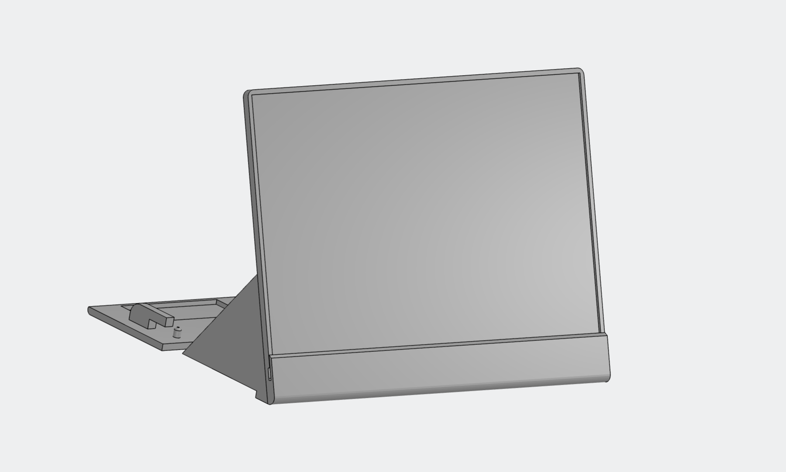
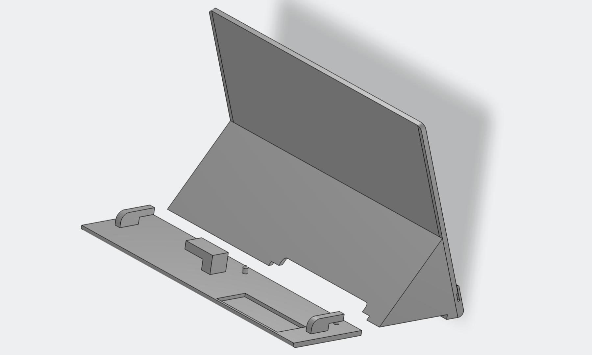
</div>

## Step 2: Surface Finishing
A clean finishing process is critical. Remove any stringing or burrs from the print. Carefully edge-sand the inner locking mechanism using fine-grit sandpaper to ensure tight mechanical tolerances for a seamless snap-fit assembly. Sand the required surfaces as needed. The areas I sanded are shown below.
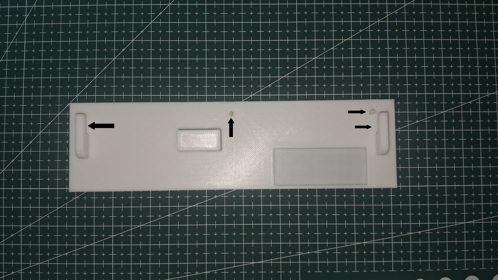
<div>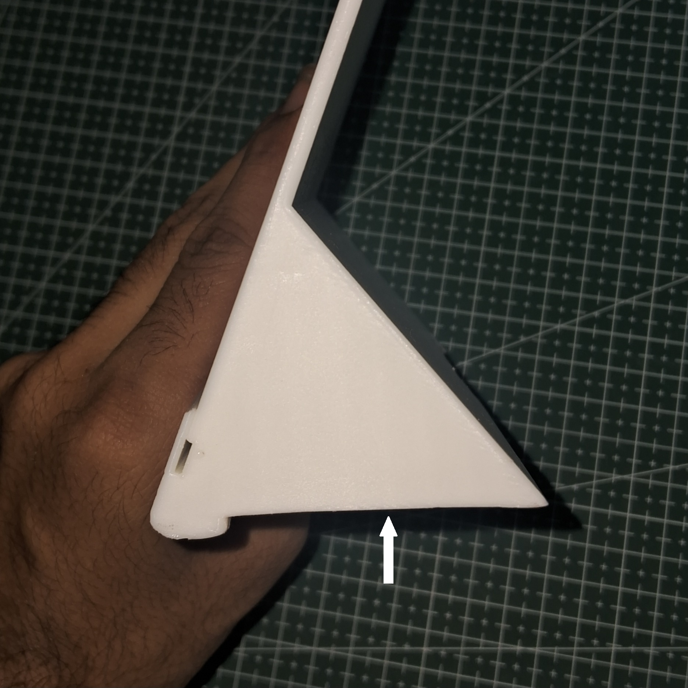</div>

## Step 3: Display Insertion
Gently take the delicate 7.5" glass ePaper panel and slide it into the main frame tracks. Ensure you apply even, gentle pressure from the edges to avoid cracking the fragile display. If needed use thin double sided tape to keep the display held in place. The image below shows that the display has been inserted in the frame, and the FPC Cable is gently pulled through the slit in the frame with the help of tweezers. 
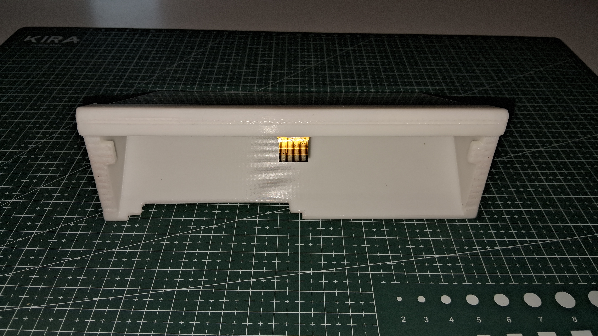

## Step 4: Ribbon Cable Extension
Locate the small FPC connector on the ePaper display. Carefully pop open the black retaining latch, slide in the flat flexible ribbon extension cable, and press the latch down securely to lock the pins in place. The image below shows the ribbon cable being attached to the display's FPC Cable.
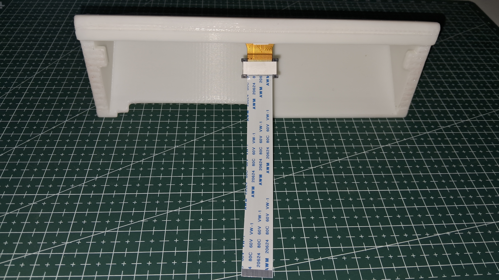

## Step 5: Place the Battery
Gently slide the rechargable battery in the slot as shown below. Ensure that the slot is not too tight nor too loose, if needed sand the surface. Do not apply excessive pressure to push the battery in the slot, avoid puncturing the battery in the process.
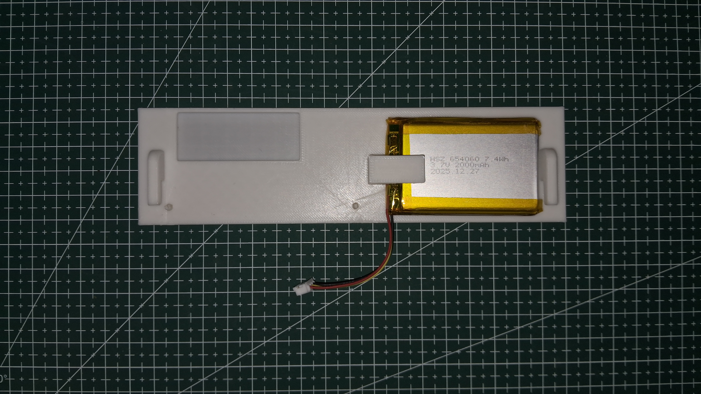

## Step 6: Driver Board Hookup
Map the other end of the display ribbon cable to the FPC port on the main control board. Next, plug the 3.7V LiPo battery pack into the corresponding JST power port on the driver board. 
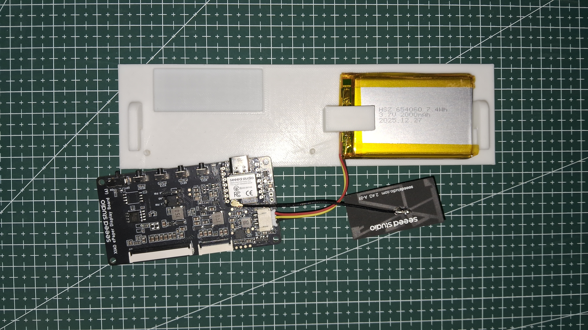

## Step 7: Component Packaging
Tuck the connected the driver board, and the managed wire bundles neatly within the main frame cavity. Ensure no cables/antenna are pinched near the outer areas.  Gently fold the FPC cable without making sharp turns or tight folds as that could damage the FPC cable. Ensure that the display select jumper is set to 24 Pin Mode.
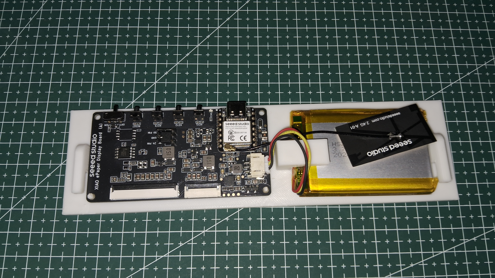

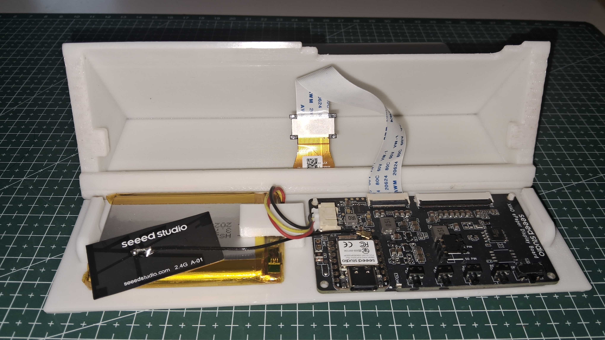

## Step 8: Back Plate Installation
Align the final base plate with the main frame. Slide the lock cleanly into place, closing up the device flush.
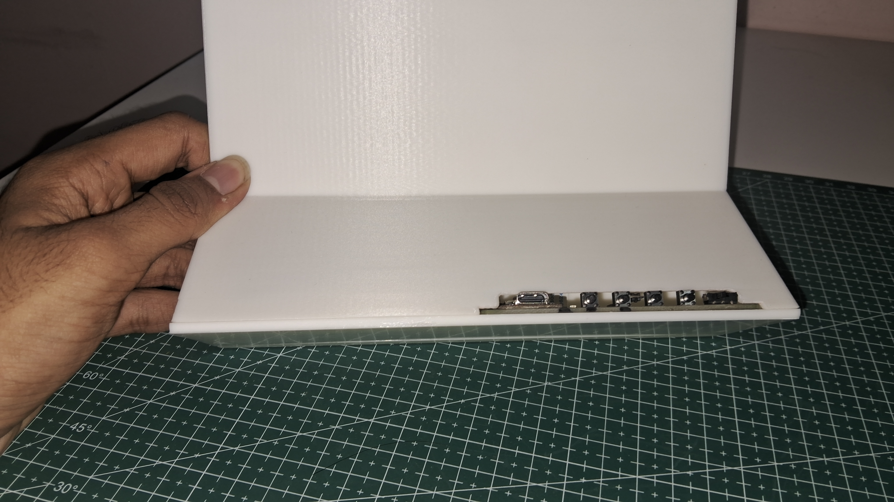

## Step 9: The FlintOS Software Stack

### a. Code Architecture Summary:
*   The FlintOS firmware engine is built on a highly efficient core loop prioritizing a **Dual-Mode System**.
*   Users can seamlessly toggle between "**Productivity Mode**" (**API Based Dashboards**) and "**Slideshow Mode**" (**Digital Photo Frame**) **by pressing the PREV and NEXT buttons simultaneously**.
*   This is handled via optimized code, ensuring the device never misses a button press. Furthermore, real-time **elements like clocks and timers update instantly** using isolated **partial screen refreshes**, completely avoiding the jarring full-screen black-and-white flashing typical of e-Ink displays.

### b. User Configuration & Personalization:
Customizing FlintOS requires updating a centralized configuration block to manage the 5 live API pipelines. **Create a account with the below mentioned API services to generate a free API key**, most API providers used for this project have a decent number of daily/monthly tokens.

**API Services Used:**
1. **OpenWeatherMap API**: https://openweathermap.org/api
2. **CoinMarketCap API**: https://coinmarketcap.com/api/
3. **ZenQuotes API**: https://zenquotes.io/
4. **Todoist API**: https://developer.todoist.com/api/v1/ (Download the **Todoist app** on your smartphone or access the **Todoist website** to schedule and organize your tasks.)
5. **Google Apps Script (Google Finance Proxy): Follow steps given below for setup.**

Users are requested to change the following section in the code with their API keys and WiFi Credentials:
```cpp
// --- Wi-Fi Credentials ---
const char* WIFI_SSID = "";             // Paste your Wi-Fi SSID / Network Name here
const char* WIFI_PASSWORD = "";                // Paste your Wi-Fi Router Password here

// --- API Keys ---
const char* OWM_API_KEY = ""; // Paste your OpenWeatherMap API Key here
const char* CITY = "Bengaluru";                               // Paste your City Name
const char* COUNTRY_CODE = "IN";                              // Paste your Countey Code

const char* CMC_API_KEY = ""; // Paste your CoinMarketCap API Key here
const char* CMC_SYMBOLS = "BTC,ETH,SOL,DOGE";                 // Paste 4 codes of the Crypto Currency you want to track

const char* ZEN_API_KEY = ""; // Paste your ZenQuotes API Key here

const char* TODOIST_API_KEY = ""; // Paste your Todoist API Authorization Token here

// --- Cloud Script API Gateways ---
const char* STOCK_API_URL = ""; // Paste your deployed Google Apps Script Stock Web App URL link here
```

If needed users can change the duration at which the dashboards are changed and the duration at which photos are switched by changing this part of code:
```cpp
// --- Timing Intervals (in milliseconds) ---
const unsigned long SCREEN_SWITCH_INTERVAL = 300000;    // Duration to switch between metric dashboard screens automatically (e.g., 5 mins)
const unsigned long DATA_FETCH_INTERVAL = 900000;       // Duration between system cloud synchronizations and API background fetches (e.g., 15 mins)
const unsigned long POPUP_INTERVAL = 1800000;           // Duration before the health and wellness self-care popup screen appears (e.g., 30 mins)
const unsigned long SLIDESHOW_IMAGE_INTERVAL = 300000;  // Duration of photo slideshow frame transitions when slideshow mode is active (e.g., 5 mins)
```

### c. Custom Market API Integration: 
FlintOS tracks both cryptocurrencies (BTC, ETH, SOL, DOGE) through CoinMarketCap API and standard Indian stocks through a custom API.

To get reliable stock market data, we use a custom coded API which is handled via a Google Apps Script pipeline. The device is able to use standard HTTP GET requests to get data directly from Google Finance through Google Sheets which allows users to easily select the particular stocks to be displayed. The ESP32 fetches a pre-parsed JSON payload containing 5 custom stocks. The firmware dynamically calculates layout math, text-truncates long company names, and renders a custom Rupee (₹) symbol.
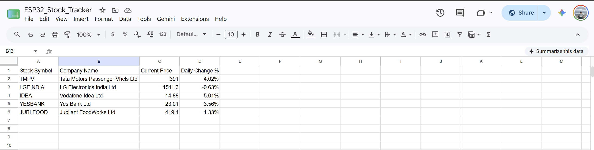

The image above shows the Google Sheets file that can be modified to display the selected stocks on the device (File can be accessed [here](https://docs.google.com/spreadsheets/d/1ReXH9nMjMBnryNf1LTMIYxpdZ_eqrDqsATdgiEig-30/edit?usp=sharing)). You can make a copy of this file and follow the steps given below to setup the custom Stock Market API:

*   **Step 1:** Make a copy of the google sheets file. Update the column A1 with 5 Stock Symbols, all other cells update automatically.

*   **Step 2:** Go to **Extensions > Apps Script**
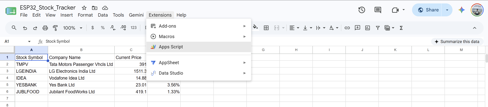

*   **Step 3:** Paste the following code (code will most likely be shared along with the previously shared Google Sheet):
```javascript
function doGet() {
  // Open the spreadsheet and bind to the very first tab
  var ss = SpreadsheetApp.getActiveSpreadsheet();
  var sheet = ss.getSheets()[0];
  
  // UPDATED: Read rows 2 through 6, but start at Column 1 (A) instead of 2 (B)
  // Range parameters: (startRow, startColumn, numRows, numColumns)
  var dataRange = sheet.getRange(2, 1, 5, 4); 
  
  // Fetch text strings exactly as formatted on screen
  var values = dataRange.getDisplayValues(); 
  
  var stocksArray = [];
  
  // Build a structured memory structure by cycling through rows
  for (var i = 0; i < values.length; i++) {
    var stockItem = {
      "symbol": values[i][0], // Added: Column A (Ticker Symbol)
      "name":   values[i][1], // Column B (Company Name)
      "price":  values[i][2], // Column C (Current Price)
      "change": values[i][3]  // Column D (Daily Change %)
    };
    stocksArray.push(stockItem);
  }
  
  // Wrap array into a single root JSON object
  var payload = {
    "stocks": stocksArray
  };
  
  // Serialize the structure into a text stream and push to network edge gateway
  return ContentService.createTextOutput(JSON.stringify(payload))
    .setMimeType(ContentService.MimeType.JSON);
}
```
*   **Step 4:** Click **Deploy**, and then click on **New Deployment**.
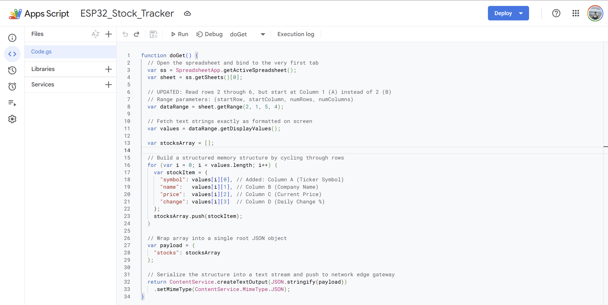

*   **Step 5:** Make the following configurations (**Who has access should be set to Anyone**, or else our device will not be able to use the created API), and click on **Deploy**.
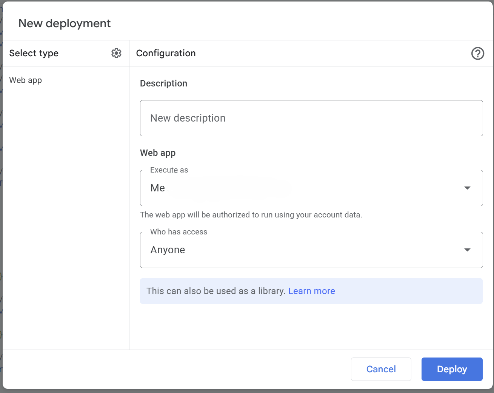

*   **Step 6:** Click on **Authorize access**.
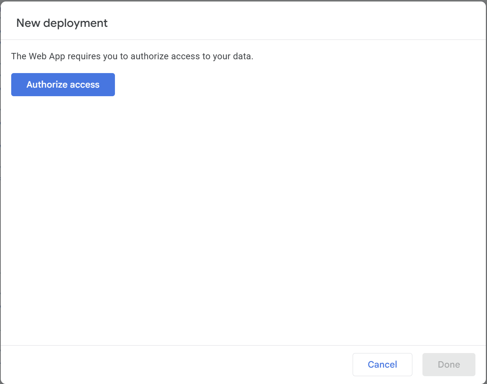

*   **Step 7:** Click on **Advanced** and then click **Go to `ESP32_Stock_Tracker` (unsafe)**, and then continue the signup process, you will be the sole user of the created API so it is totally safe to use.
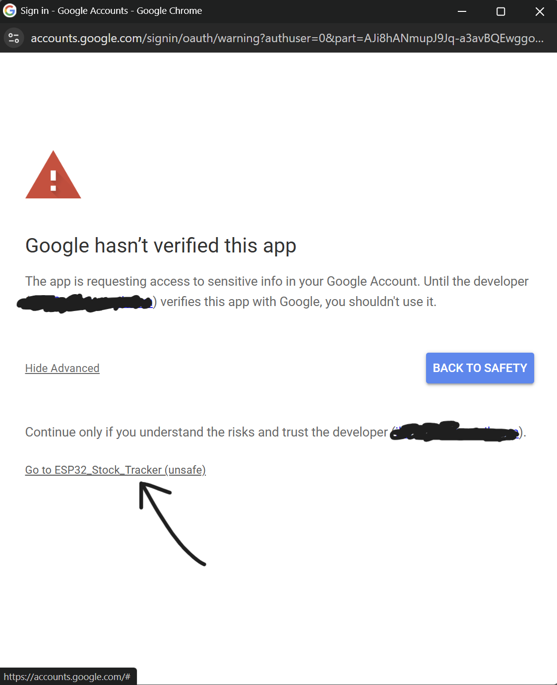

*   **Step 8:** Once you are done, you'll be able to access the Web App link, **copy this link and paste in the main code**.
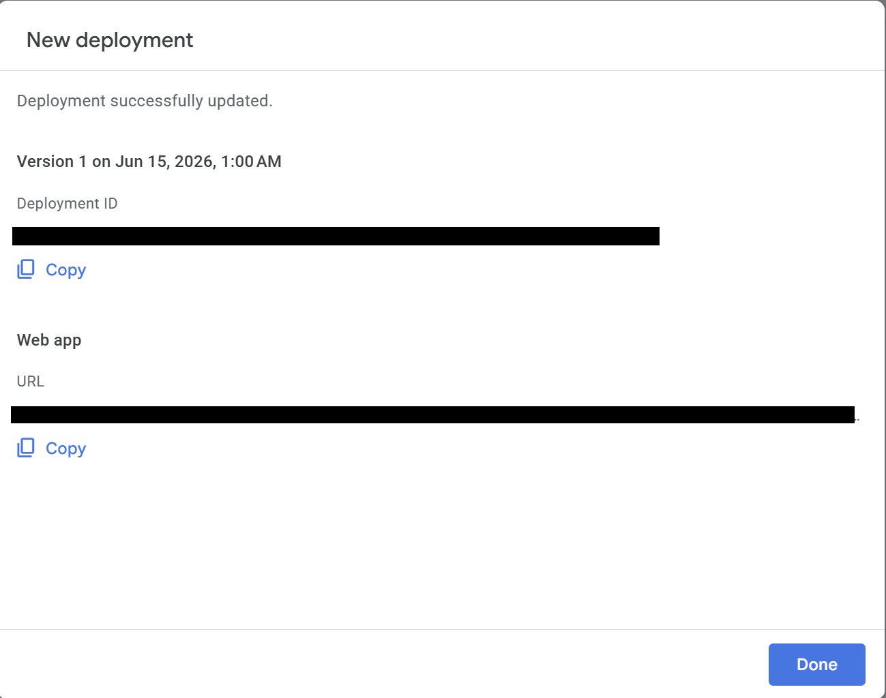

### d. Asset Compilation (Image to dithered arrays):
FlintOS uses a dedicated `icons.h` file to cleanly store 1-bit monochrome graphics for weather conditions, currency, and battery status. Users can take any graphic, run it through the **image2cpp** tool (Link), adjust thresholding, and export PROGMEM byte arrays.

In Slideshow Mode, the system cycles through personal 800x480 pixel images stored directly on the ESP32's permanent flash memory stored in **`slideshow_images.h`** file, overlaid with a **floating clock that updates via partial refresh**.

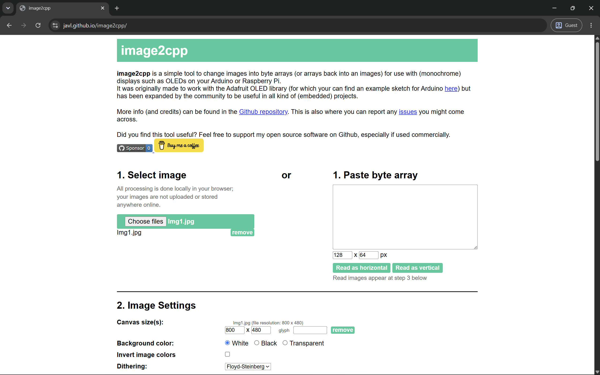

Follow these steps to get your images converted to the required format:
*   **Step 1:** Choose your favorite image. Resize it to exactly 800x480 pixels (Landscape-oriented images look best on this layout).
*   **Step 2:** Open your web browser and navigate to the image2cpp converter tool: Link -> https://javl.github.io/image2cpp/
*   **Step 3:** Upload your image. In the 'Image Settings' block:
    *   Change Dithering to 'Atkinson' or 'Floyd-Steinberg' to get a crisp e-ink sketch print.
    *   Adjust the 'Brightness / Alpha Threshold' slider (works only with Atkinson) while checking the preview container to confirm image look sharp.
*   **Step 4:** Scroll down to the 'Output' zone:
    *   Set Code Output Format to 'Plain bytes'.
    *   Click the 'Generate code' button.
*   **Step 5:** Copy the generated data block and paste it inside the curly brackets of your target variable slot below (for e.g., replace the body of `img_panel_0`).

```cpp
#ifndef _SLIDESHOW_IMAGES_H_
#define _SLIDESHOW_IMAGES_H_

#include <pgmspace.h>

const int NUM_SLIDESHOW_IMAGES = 5;

const unsigned char img_panel_0[] PROGMEM = {
};

const unsigned char img_panel_1[] PROGMEM = {
};

const unsigned char img_panel_2[] PROGMEM = {
};

const unsigned char img_panel_3[] PROGMEM = {
};

const unsigned char img_panel_4[] PROGMEM = {
};

const unsigned char* const slideshow_images[NUM_SLIDESHOW_IMAGES] = {
  img_panel_0,
  img_panel_1,
  img_panel_2,
  img_panel_3,
  img_panel_4
};

#endif
```

### e. Development Environment Setup & Firmware Upload
To flash FlintOS onto your hardware, open the **Arduino IDE** and ensure you have installed the official **ESP32 Board Library** via the Boards Manager (**Tools > Board > Boards Manager**). Once the library is initialized, navigate to your board selection menu and select **Seeed Studio XIAO ESP32S3** (ensuring you select the PLUS variant from the dropdown list). Open the shared FlintOS.ino firmware files, connect your device via the USB Type-C cable, and choose the corresponding **COM Port** from the tools menu before hitting the **Upload** button.

Download the **ArduinoJSON** library by **Benoit Blanchon**.

> **Pro Tip (Download Mode):** If the Arduino IDE fails to detect the device or throws a serial port error during your very first connection, physically press and hold the hardware **BOOT button** on the driver board while plugging the USB cable into your computer. This forces the MCU into its **Download Mode**, by which board gets detected and code can be uploaded.

## Hardware Controls & Key Mapping
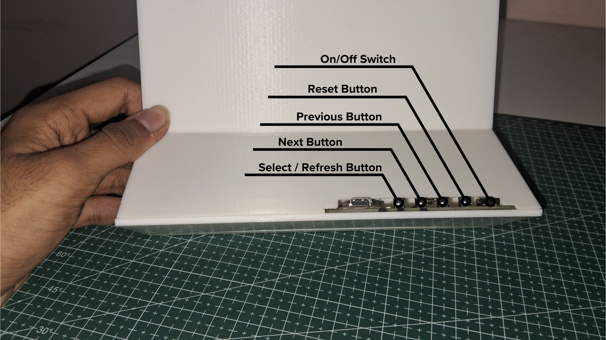

Flint abandons touchscreens in favor of a tactile, deliberate navigation system to maintain its distraction-free ethos. The hardware utilizes a simple array of physical inputs to drive the entire OS:
*   **Reset Button:** A hardware-level interrupt switch. This is not coded into the FlintOS firmware; rather, it physically cycles power to the ESP32 to initiate an immediate hard reboot of the device if needed. This is useful in cases where WiFi is taking too long to connect or if the device is taking too long to fetch data.
*   **Prev (Previous):** Navigates backward through the data dashboards in productivity mode or manually cycles to the previous photograph while in Slideshow Mode.
*   **Next:** Advances forward to the next data dashboard in productivity mode or the next photograph in the Slideshow Mode.
*   **Select / Force Refresh:** Acts as an action key for specific dashboard screens (such as starting or stopping the Focus Session Stopwatch). If pressed independently on a static data screen, it forces an immediate, full-screen manual wipe to update the data on that particular screen.
*   **Mode Toggle (Prev+Next):** A programmed two button input. Pressing the Prev and Next buttons simultaneously triggers the device to instantly swap between Productivity Mode and the Digital Photo Frame Mode.

## Understanding Your Dashboard's Power Management and Battery Life
This e-paper dashboard is engineered for maximum power efficiency, utilizing a dedicated hardware cutoff pin that physically **disconnects the battery-measuring circuit between checks to prevent silent power leaks**.

The **software reads the raw voltage and translates it into an easy-to-understand percentage**, though it is important to remember that **Lithium-Polymer (LiPo) batteries do not drain in a perfectly straight line**; they hover near 100% for a long time before dropping much faster at the bottom of their charge (a phenomenon known as the "**LiPo Cliff**").

By optimizing the Wi-Fi to reuse network connections and utilizing the e-paper screen's ability to hold an image without drawing power, the device achieves a highly efficient average current draw of just ~15.5 mA. Translating this to real-world performance on a standard 2000 mAh battery, you get roughly 128.5 hours of total continuous runtime, meaning the device will comfortably last for **about 10 days** if kept active for **12 hours a day**, and a solid **7-8 days** on a single charge **under 16 hours a day usage**.


## Future Improvements
The Flint ecosystem is designed to be highly extensible. Future developments on the roadmap include:
*   **Ambient Light Sensing:** Integrating onboard photo-resistors to dynamically switch FlintOS between light and dark templates based on the room's day/night cycle.
*   **Web UI Configuration Dashboard:** A local web-based portal that lets users easily upload Images, update Wi-Fi credentials, and modify device settings directly from a browser without recompiling the C++ code.
*   **Injection-Molded Upgrades:** Designing an ultra-thin, mass-producible injection-molded enclosure for users who prefer factory-grade hardware over 3D-printed aesthetics.
*   **Introducing More Dashboards:** More functional dashboards like news, youtube channel analytics, google calendar, github repo statistics, etc can be added through the same API call techniques based on user preference.

## Conclusion


Flint is more than just a microcontroller taped to an ePaper screen, it is an exercise in restraint. By deliberately choosing what information deserves physical space on our desks, we reclaim our workspaces from the constant barrage of attention-grabbing notifications. Flint proves that with intentional design choices, a simple desktop gadget can be elevated into a calming piece of functional art. Build it, set it, and finally focus.

If you want to explore more, check out my [profile](https://github.com/ameya-angadi) for related projects, and don't forget to follow me for updates on new tutorials and advanced projects!
